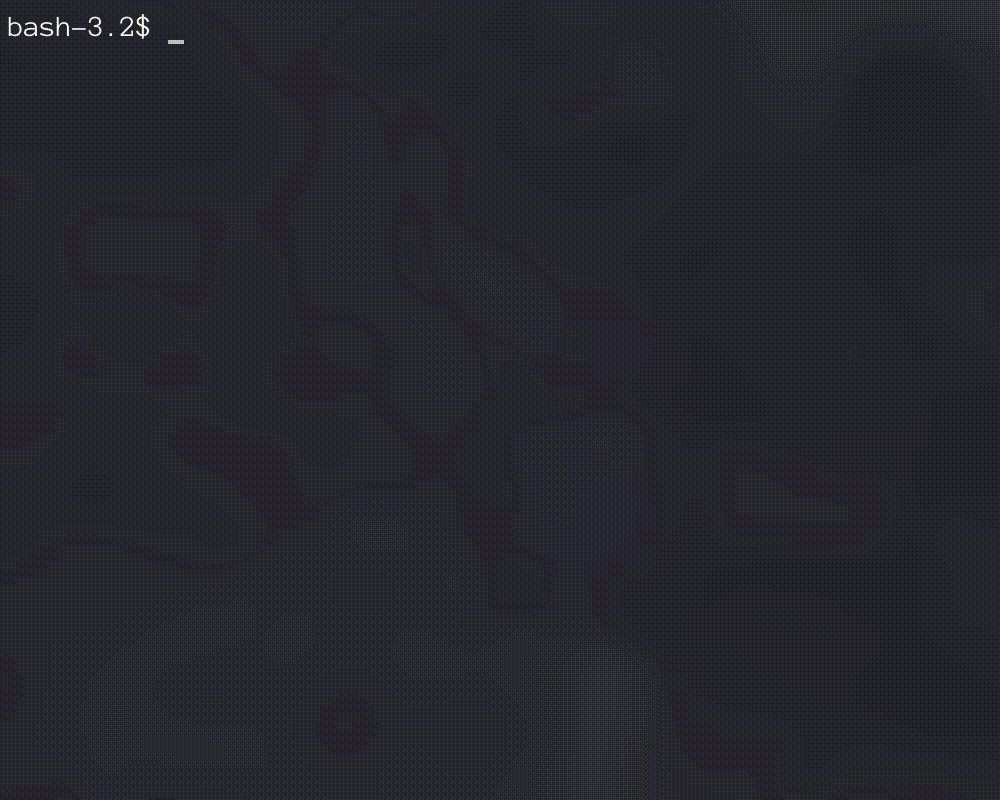
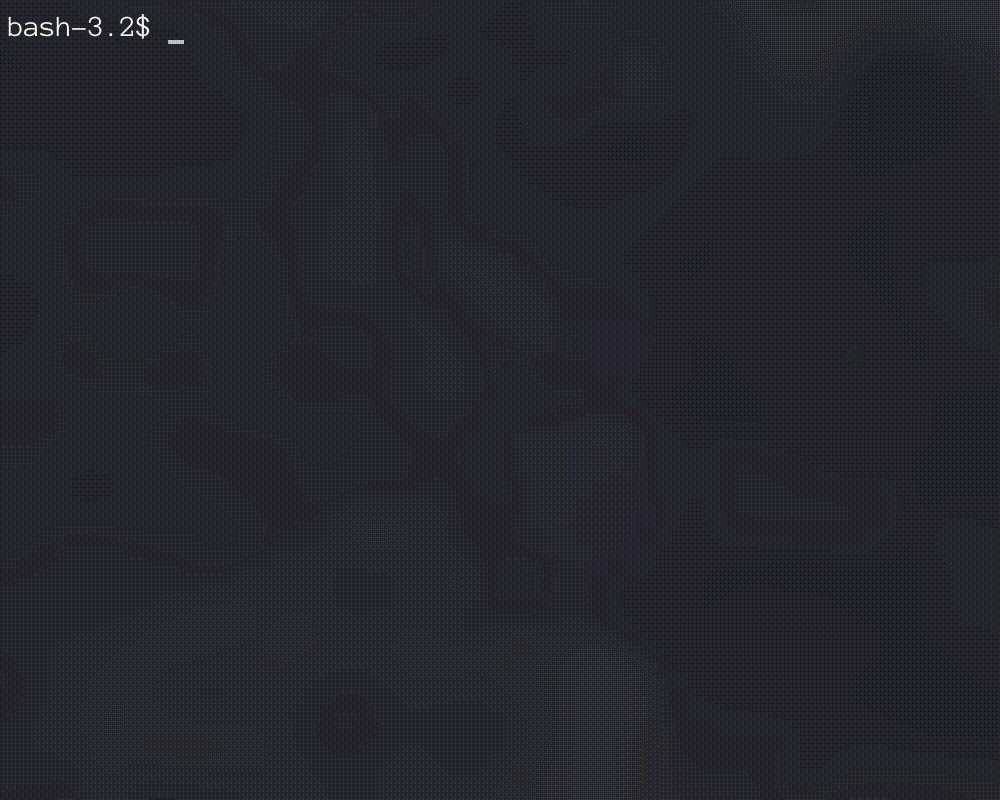

# Foldercode CLI (fcode)


## What is Foldercode CLI?

Foldercode CLI is a command line tool which gives you an ability to use 'Foldercode' with command line interface.

You can find more about Foldercode in [foldercode.com](https://foldercode.com/)

fcode makes, sending your files anywhere so fast with your command line interface, easy.

### How to use?
#### Upload

#### Get (Download)



### Installation
**Installing with HomeBrew**

MacOSX
```
brew tap bilgehannal/bilgehan
brew install fcode
```

**Installing with wget**

Requirements:
* wget must be installed.

Run the command below:

MacOSX (Intel)
```
wget -q -O - https://raw.githubusercontent.com/bilgehannal/foldercode-cli/main/install.sh | bash -s darwin amd64
```

MacOSX (Apple Sillicon)
```
wget -q -O - https://raw.githubusercontent.com/bilgehannal/foldercode-cli/main/install.sh | bash -s darwin arm64
```

Linux (amd64)
```
wget -q -O - https://raw.githubusercontent.com/bilgehannal/foldercode-cli/main/install.sh | bash -s linux amd64
```

Linux (arm64)
```
wget -q -O - https://raw.githubusercontent.com/bilgehannal/foldercode-cli/main/install.sh | bash -s linux arm64
```
**Manual Installing**
* Go to [releases page](https://github.com/bilgehannal/foldercode-cli/releases)
* Download tar file according to your os (`linux` or `darwin`(`macosx`)) and hardware architacture(`amd64` or `arm64`)
* Extract the tar file
* Move `fcode` to `/usr/local/bin`
* Give executable permissions with `chmod +x /usr/local/bin/fcode`
---
[](https://svgshare.com/i/ZjP.svg) [](https://svgshare.com/i/Zhy.svg)
[](https://go.dev/)